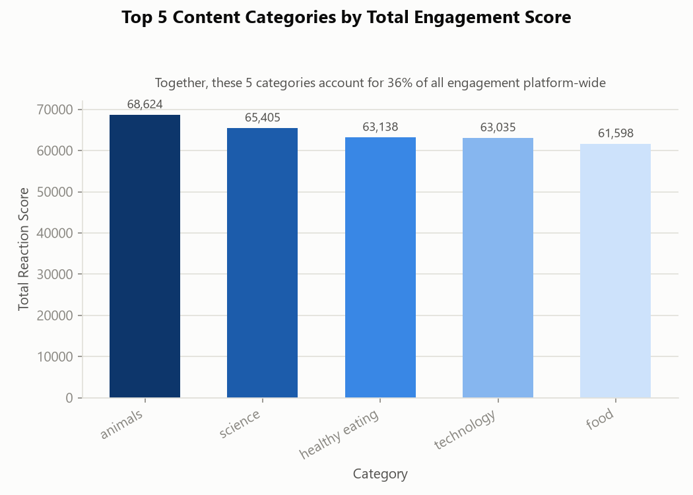
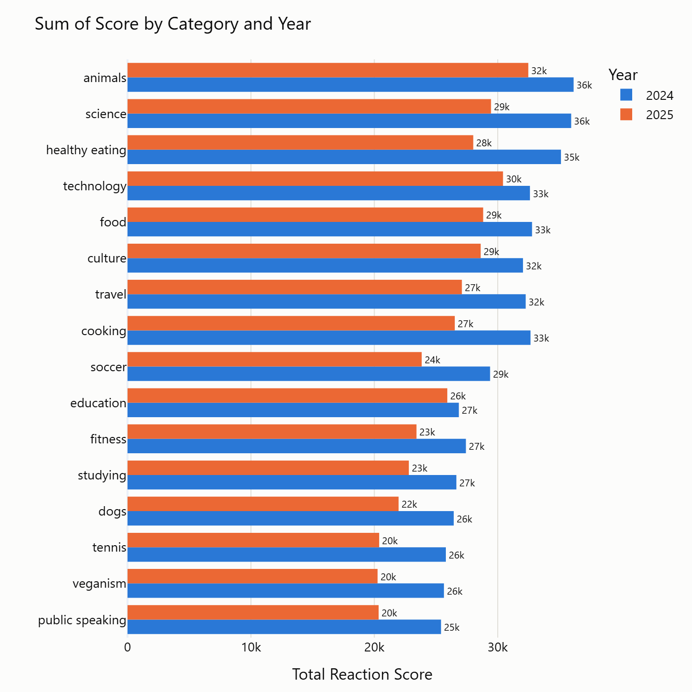
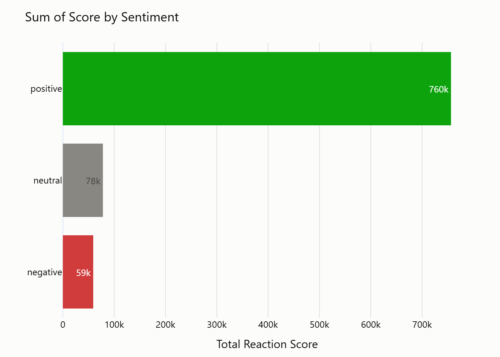

# Social Buzz Content Analysis

A full data analytics pipeline — cleaning, merging, statistical analysis, visualization, and automated reporting — built in Python to answer a real content-strategy question: **which content categories drive the most positive engagement, and where should a platform invest next?**

Rather than stopping at a chart, this project ends with a 17-page, client-ready PDF report: business-framed findings, a validated visual design system across 18 charts (static and interactive), and analytical caveats caught and corrected along the way — the kind of rigor that separates a real recommendation from a surface-level read of a chart.

## Overview

Social Buzz is a social media platform where users react to posts with over 100 distinct reaction types (not just "like"), each carrying its own point value. The raw data — 1,000 posts and 25,553 reactions across three separate files — was messy: inconsistent category naming, missing values, a column-naming collision on merge, and an ambiguous date format. This project cleans and unifies that data, then answers the core business question with a ranked, validated result and supporting analysis of sentiment, content type, and timing.

*(Business scenario based on Accenture's "Social Buzz" case study.)*

## Key Findings

**Top 5 content categories by total engagement score:**
1. Animals — 68,624
2. Science — 65,405
3. Healthy Eating — 63,138
4. Technology — 63,035
5. Food — 61,598

This ranking was independently cross-checked against a separately built reference analysis using the same underlying dataset, producing the **identical top-5 ranking in the identical order** — strong validation that the pipeline's logic is correct.

**Scale:** the top 5 categories together account for **36% of all engagement earned platform-wide** — meaningfully more than the 31% an even split across 16 categories would produce.

**Volume, not quality:** the average score per individual reaction is nearly identical across every category platform-wide (~39–41 points, under 4% spread). The top categories win because they draw more total reactions, not because each reaction is more enthusiastic — a real strategic distinction between a reach problem and a content-quality problem.

**Sentiment:** 56.2% of all reactions were positive, 31.2% negative, 12.5% neutral (by count); by total score, positive reactions dominate even further (756K of 893K total points), since positive reaction types tend to carry higher point values. This mix is nearly identical between the top 5 categories and the rest of the platform — reinforcing that the top 5 win on volume, not sentiment.

**Content type:** fairly even split platform-wide — photo (26.8%), video (25.4%), GIF (24.8%), audio (23.0%). Within the top 5 categories specifically, audio over-indexes somewhat (27% vs. 21% elsewhere).

**A caught analytical trap:** the raw year-over-year chart appears to show a real decline in engagement — but the dataset actually spans one rolling year (mid-June to mid-June), not two full calendar years, so one year's label covers an extra month of data. Once that's accounted for, average reactions per full month are nearly identical (1,898 vs. 1,862) — there is no real year-over-year change. This kind of check is exactly what keeps a surface-level chart read from becoming a wrong business conclusion.

## Sample Visualizations





18 charts total (12 static PNG + 6 interactive HTML with hover tooltips) are in [`charts/`](charts/); the full narrative with all of them embedded is in the [PDF report](Social_Buzz_Content_Analysis_Report.pdf).

## What This Project Demonstrates

- **End-to-end pipeline** — raw, messy multi-file data taken through cleaning, merging, aggregation, and visualization to a finished report, with no manual steps in between
- **Real data-cleaning problems solved** — inconsistent text formatting (41 raw category variants normalized to 16), missing values, a column-naming collision surfaced by a merge, an ambiguous international date format
- **Statistical rigor** — identified and corrected a misleading year-over-year comparison caused by uneven date-range coverage, rather than reporting the surface-level (and wrong) read
- **Data visualization design** — a validated, colorblind-safe color system applied consistently across every chart; fixed identity colors per category/year (not reassigned by rank); deliberately avoided 3D and pie-chart forms where they would have misrepresented the data
- **Both static and interactive visualization** — Matplotlib for print-quality static charts, Plotly for hover-to-explore interactive versions
- **Automated report generation** — a 17-page PDF built programmatically (`fpdf2`), with charts, findings, and a "Key Takeaway" per chart assembled directly from the analysis, not written by hand

## Tech Stack

Python · pandas · Matplotlib · Plotly · fpdf2

## Project Structure

- `Content.csv`, `Reactions.csv`, `ReactionTypes.csv` — the 3 raw source datasets
- `content_analysis.py` — cleaning → merging → scoring → visualization → temporal analysis
- `generate_report.py` — builds the PDF report from the charts and findings
- `requirements.txt` — Python dependencies
- `charts/` — all 18 generated charts (`.png` static, `.html` interactive)
- `Social_Buzz_Content_Analysis_Report.pdf` — the final report

## How to Run

```
pip install -r requirements.txt
python content_analysis.py    # cleans the data, builds all 18 charts into charts/
python generate_report.py     # builds the PDF report from those charts (run second)
```

## Data Cleaning Notes

- `Content.csv`'s `Category` column had 41 different-looking values for what was really only 16 categories, caused by inconsistent capitalization and stray quote marks baked into the text — fixed with `.str.strip('"').str.lower()`.
- `Reactions.csv` had 3,019 rows missing a `User ID` and 980 rows missing a `Reaction_Type` — fully overlapping (every row missing a `Reaction_Type` was also missing a `User ID`). Removed with `.dropna()`, leaving 22,534 clean rows (from 25,553).
- Merging `Content` and `Reactions` caused a naming collision (`User ID` existed in both, meaning different things in each) — resolved by dropping both auto-suffixed copies, since neither was needed for the analysis.
- `Datetime` was written `DD-MM-YYYY`, requiring `dayfirst=True` in `pd.to_datetime()` to avoid silently misreading ambiguous dates.
